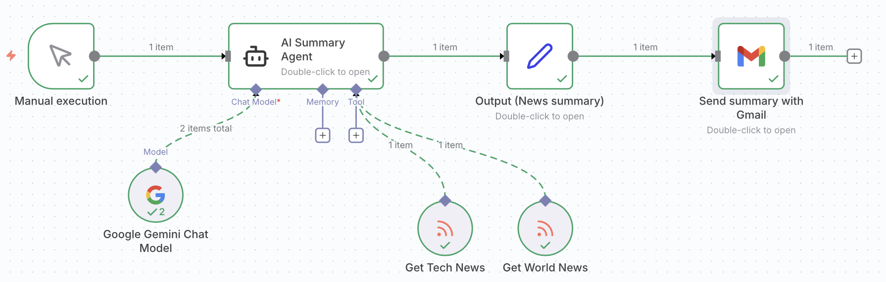
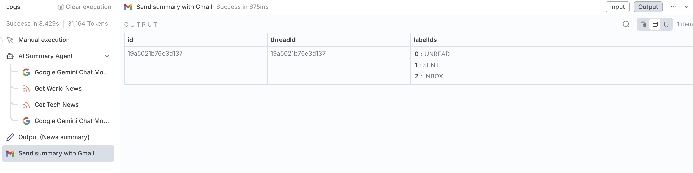
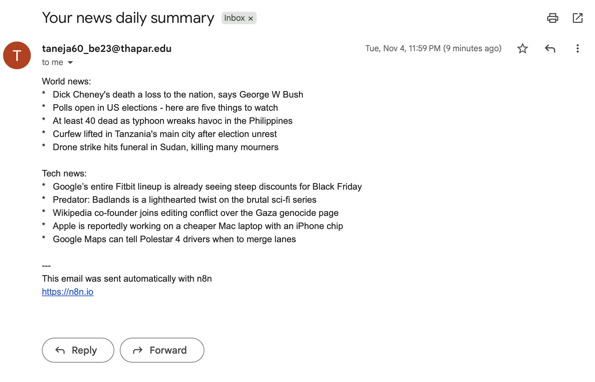

# 📰 AI-Powered News Summarization Agent (n8n)

This project is an AI-driven automation workflow built using n8n that retrieves, summarizes, and delivers daily news updates.

It integrates RSS feeds, Google Gemini for summarization, and automated email delivery to create a complete end-to-end intelligent news assistant.

---

## 🚀 Overview

The workflow automates the process of:
- Fetching real-time news from trusted sources
- Summarizing content using AI (Google Gemini)
- Delivering concise summaries directly via email

It is manually triggered and designed for **self-hosted environments**, ensuring privacy and reliability.

---

## 📸 Workflow Screenshots

### ⚙️ 1. Workflow Design

This shows the complete n8n automation pipeline connecting RSS feeds, Gemini AI, and Gmail delivery.

---

### 🤖 2. AI Processing Output

This demonstrates how Gemini processes and summarizes incoming news articles into concise insights.

---

### 📧 3. Final Email Output

This is the final structured email delivered to the user’s inbox containing AI-generated news summaries.

---

## ⚙️ Workflow Architecture
Manual Execution → AI Summary Agent (Gemini Chat Model + RSS Nodes: Tech
News from The Verge, World News from BBC) → Set Node → Gmail Node (Send
Message)

---

## 🔄 Workflow Breakdown

### 1️⃣ Manual Execution Node
- Acts as the trigger for the workflow
- Allows users to run the process on demand

---

### 2️⃣ AI Summary Agent

#### 📡 RSS Nodes
- Fetch latest news articles from:
  - Tech News → The Verge
  - World News → BBC International

#### 🤖 Gemini Chat Model
- Processes retrieved articles
- Generates concise, context-aware summaries
- Maintains tone and relevance of original content

---

### 3️⃣ Set Node
- Structures and formats the summarized data
- Prepares clean output for email delivery

---

### 4️⃣ Gmail Node (Send Message)
- Sends the final summarized news digest
- Delivers directly to the recipient’s inbox

---

## 🎯 Purpose

This workflow transforms multiple live news feeds into AI-curated summaries, allowing users to:
- Stay informed efficiently
- Reduce information overload
- Receive only the most relevant updates

---

## 📊 Outcome

A fully automated AI News Agent that:

- Aggregates real-time news from trusted sources
- Generates intelligent summaries using Google Gemini
- Delivers concise updates via email

---

## 🧠 Key Concepts Used

- n8n Workflow Automation
- RSS Feed Integration
- Large Language Models (LLMs)
- AI-based Text Summarization
- Email Automation

---

## 🛠️ Tech Stack

- n8n
- Google Gemini API
- RSS Feeds
- Gmail API

---

## 📌 Notes

- Designed for self-hosted n8n setups
- Manual trigger ensures controlled execution
- Ensure API credentials are securely configured
- Do not expose API keys in workflow JSON

---

## 👩‍💻 Author

Tanvi Aneja  
B.Tech Robotics & AI Engineering
